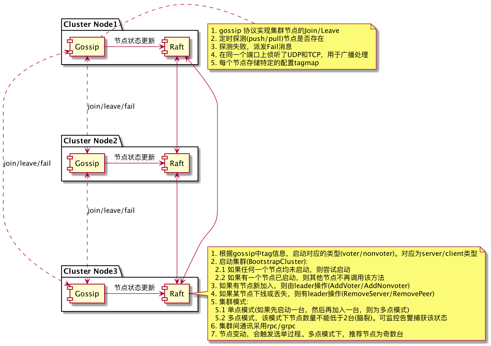

## 集群插件

### 目的

用于快速开发集群类服务。

### 主要涉及协议

```
1. gossip 节点探测
2. raft leader选举
3. rpc/grpc 集群间数据通讯
```

### 相关仓库

```
github.com/hashicorp/memberlist
github.com/hashicorp/raft
github.com/hashicorp/serf
```


### Code Sample

```go
import (
   `flag`
   `strings`

   `github.com/astaxie/beego/logs`
   `hutte.zhanqi.tv/go/svr-frame/define/frame`

   `hutte.zhanqi.tv/go/cluster-plugin/plugin`
)

var (
   join     string
   serfPort int
   raftPort int
   httpPort int
   rpcPort  int
   agent    string
   except   int
)

func init() {
   flag.StringVar(&join, "join", "", "127.0.0.1:1025,127.0.0.1:1035, gossip协议地址的组合")
   flag.IntVar(&serfPort, "serf", 7770, "gossip协议端口")
   flag.IntVar(&raftPort, "raft", 0, "raft协议端口，可选，默认为sert+1")
   flag.IntVar(&rpcPort, "rpc", 0, "rpc协议端口，可选，默认为raft+1")
   flag.IntVar(&httpPort, "http", 0, "http协议端口，可选，默认为rpc+1")
   flag.IntVar(&except, "except", 0, "except server node num, recommend is 3 or 5")
   flag.StringVar(&agent, "agent", "server", "传递server,或client")

   logger := logs.GetBeeLogger()
   logger.EnableFuncCallDepth(true)
   logger.SetLogFuncCallDepth(3)
}

func main() {
   flag.Parse()

   var peers []string
   if len(join) > 0 {
      peers = strings.Split(join, ",")
   }

   agentType := plugin.NodeTypeServer
   if agent == "client" {
      agentType = plugin.NodeTypeClient
   }

   args := plugin.ClusterArgs{
      Role:     "cluster-plugin",
      Agent:    agentType,
      SerfPort: serfPort,
      RaftPort: raftPort,
      RpcPort:  rpcPort,
      HttpPort: httpPort,
      Except:   except,
      Peers:    peers,
   }

   cluster, err := plugin.CreateCluster(args, nil)
   if err != nil {
      return
   }
   //
   sig := frame.WatchSignal()
   logs.Info("exit with:", sig)
   //
   cluster.Shutdown()
}
```

